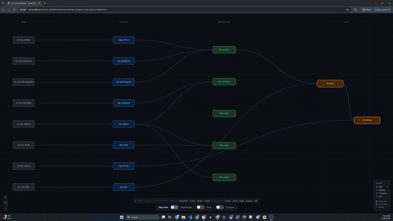

# Tee for Transform

<p align="center">
  
</p>

**This is a "what if" project**: What if a transformation tool supported functions? What if it allowed for richer metadata? What if data modeling was a priority? After a chat with a friend, I decided to see how far I could go...

A Python framework for SQL data transformations with **DuckDB** (including **MotherDuck**) and **Snowflake** as the mature adapters today; **PostgreSQL**, **BigQuery**, and others are **in progress**. It includes automatic SQL dialect conversion where adapters support it, and rich metadata-driven modeling. It treats the **data model** (semantics, dimensions, and how objects relate) as a first-class concern alongside **running the pipeline**. Named "Tee for Transform" (abbreviated as **t4t**), but also because everyone loves a good t-shirt! 👕

## 🚀 Quick Start

```bash
# Install t4t (DuckDB included — no extra drivers needed)
pip install t4t

# Create a new project (DuckDB by default: data/<name>.duckdb, models/, seeds/, tests/)
t4t init my_project

# Optional: pick another backend
# pip install t4t[snowflake]   # Snowflake
# pip install t4t[postgres]    # PostgreSQL (adapter in progress)
# pip install t4t[bigquery]    # BigQuery (adapter in progress)
# t4t init my_project -d snowflake

# Add a model (SQL file)
echo "SELECT 1 AS id, 'hello' AS message" > my_project/models/my_first_model.sql

# Confirm config and connectivity (edit my_project/project.toml first if not using defaults)
t4t debug my_project

# Run models
t4t run my_project
```

Python models live under `models/` too. With the **`@model`** decorator (`my_project/models/hello_py.py`):

```python
from t4t.parser.processing.model import model

@model(description="Hello from a decorated function")
def hello_py():
    return "SELECT 1 AS id, 'hello' AS message"
```

Without a decorator, register at import time using **`create_model()`** (`my_project/models/hello_factory.py`):

```python
from t4t.parser.processing.model import create_model

create_model(
    table_name="hello_factory",
    sql="SELECT 2 AS id, 'hello from create_model' AS message",
    description="Registered programmatically at import",
)
```

The parser reads these definitions from source. Details: [Model API](docs/api-reference/models.md).

**Coming from dbt?** You can generate a t4t layout from an existing project with `uv run t4t import <path-to-dbt-project> <path-to-new-t4t-project>` (see `t4t import --help`).

**Prefer a hand-written `project.toml`?** Create a folder, add `project.toml`, `models/`, and the rest yourself. The layout matches what `t4t init` produces.

## ✨ Key Features

**Authoring** is how you define transformations; **semantic metadata** describes meaning in the warehouse; **runtime** executes against the database; **interoperability** covers **OTS** and **dbt** import paths; **configuration and quality** tie the project together.

### Authoring

- **Models in Python**: Define SQL transformations and typed metadata with `@model`, and data-quality checks with `@test`, in `.py` files, not only standalone `.sql` files
- **Many definitions per script**: A single module can register multiple models and tests using shared logic, loops, or codegen, with no need for one file per definition
- **User-Defined Functions (UDFs)**: Create reusable SQL and Python functions, if supported by the database.
- **No Jinja in SQL**: Parametrize, deduplicate, and generate SQL with Python (`@model` modules) or UDFs, with no `{{ }}` templating layer in model files

### Semantic layer, metadata, and dimensional modeling

- **Rich metadata**: Python-based model and column metadata with full type safety; the same fields power documentation, tests, and dimensional analysis ([models & metadata](docs/api-reference/models.md))
- **Facts, dimensions, and lookups**: Classify models with `table_type` **fact**, **dim** / **dimension**, or **lookup**, and link fact columns to conformed dimensions with **`dimension`** metadata so objects carry semantic roles beyond plain SQL
- **Data model documentation**: Generated static documentation combines the **dependency graph**, **dimensional relationships**, and **fact grain** so people (and tools) navigate the warehouse as a **data model**, not only a task DAG ([documentation site](docs/user-guide/documentation-site.md))

### Runtime

- **Multi-database support**: **DuckDB** (including **MotherDuck**) and **Snowflake** are implemented today; **PostgreSQL**, **BigQuery**, and other backends are **in progress**
- **SQL dialect conversion**: Target a different engine dialect than the one you author against, where the adapter supports it ([SQL dialect conversion](docs/user-guide/sql-dialect-conversion.md))
- **Dependency-aware execution**: Automatic resolution of model and function dependencies
- **Incremental materialization**: Append, merge, delete+insert, and related strategies for efficient loads

### Interoperability

- **OTS**: [Open Transformation Specification](https://github.com/francescomucio/open-transformation-specification): export **OTS modules**, consume modules from other tools, validate, and execute them alongside native projects
- **dbt project import**: Convert **dbt** projects into a t4t layout and run them like native work; not every dbt feature maps one-to-one ([import limitations](docs/user-guide/dbt-import-limitations.md))

### Configuration, tagging, and data quality

- **Comprehensive tagging**: dbt-style tag lists for organization and tag-based model selection, plus database object tags on tables, views, and schemas where the engine supports them
- **Project configuration**: Single `project.toml` layout for connection, flags, and dialect hints
- **Data quality tests**: SQL and Python tests via `@test`, standard tests, and configurable severity, run alongside model execution or independently ([data quality tests](docs/user-guide/data-quality-tests.md))

## Demo

**Data Flow** and **Data Model** visualization in the generated docs site (not a walkthrough of the whole tool). See [Documentation site](docs/user-guide/documentation-site.md).



## 📦 Installation

```bash
# Install t4t (DuckDB included — no extra drivers needed)
pip install t4t

# With optional database drivers
pip install t4t[snowflake]   # Snowflake
pip install t4t[postgres]    # PostgreSQL (adapter in progress)
pip install t4t[bigquery]    # BigQuery (adapter in progress)
pip install t4t[all]         # All drivers

# Or with uv
uv add t4t
uvx t4t init my_project
```

## 🛠️ CLI Commands

t4t provides a comprehensive command-line interface through `t4t`. All commands can be run using `uv run t4t`:

### Initialize Project
Create a new t4t project with the proper structure:

```bash
# Initialize a new project with DuckDB (default)
uv run t4t init my_project

# Initialize with a specific database type (see Key Features → Runtime for adapter maturity)
uv run t4t init my_project -d snowflake
uv run t4t init my_project -d motherduck
uv run t4t init my_project -d postgresql
uv run t4t init my_project -d bigquery
```

The `init` command creates:
- Project directory with the specified name
- `project.toml` configuration file with database connection template and default flags
- Default directories: `models/`, `tests/`, `seeds/`
- `data/` directory (for DuckDB projects only)

**Generated `project.toml` structure (DuckDB example):**
```toml
project_folder = "my_project"

[connection]
type = "duckdb"
path = "data/my_project.duckdb"

[flags]
materialization_change_behavior = "warn"  # Options: "warn", "error", "ignore"
```

Other backends get placeholder connection keys (Snowflake host/user/warehouse, PostgreSQL host/database, BigQuery project/dataset, MotherDuck `md:` path plus optional `[connection.extra]`). Edit these to match your environment.

After initialization, edit `project.toml` to configure your database connection. **DuckDB**, **MotherDuck**, and **Snowflake** are ready for serious use; **PostgreSQL** and **BigQuery** templates are there for early adopters while those adapters are still being finished.

### Run Models
Execute SQL models in your project:

```bash
# Run all models in a project
uv run t4t run ./my_project

# Run with variables (JSON format)
# Note: CLI variables map to SQL placeholders (e.g. @start_date), not to config keys like start_value
uv run t4t run ./my_project --vars '{"env": "prod", "start_date": "2024-01-01"}'
```

### Compile Models
Compile and analyze SQL models without execution:

```bash
# Compile models and show dependency analysis
uv run t4t compile ./my_project

# Compile with variables (JSON format)
uv run t4t compile ./my_project --vars '{"env": "dev"}'
```

### Debug Connection
Test database connectivity and configuration:

```bash
# Test database connection
uv run t4t debug ./my_project
```

### Build Models with Tests
Build models and run tests interleaved, stopping on the first ERROR severity test failure:

```bash
# Build models with tests (stops on test failure)
uv run t4t build ./my_project

# Build with variables
uv run t4t build ./my_project --vars '{"env": "prod"}'

# Build specific models
uv run t4t build ./my_project --select my_model
```

The `build` command executes models and their tests in dependency order. If a model fails or an ERROR severity test fails, the build stops and dependent models are skipped. WARNING severity test failures do not stop the build.

### Run Tests
Execute data quality tests on models independently:

```bash
# Run all tests defined in model metadata
uv run t4t test ./my_project

# Run tests with variables (JSON format)
uv run t4t test ./my_project --vars '{"env": "prod"}'

# Override test severity (make specific tests warnings instead of errors)
uv run t4t test ./my_project --severity not_null=warning

# Override severity for specific table/column/test
uv run t4t test ./my_project --severity my_table.id.unique=warning

# Multiple severity overrides
uv run t4t test ./my_project --severity not_null=warning --severity unique=error
```

Tests are automatically executed after model runs with `t4t run`, but you can also run them independently using the `test` command. See [Data Quality Tests](docs/user-guide/data-quality-tests.md) for more information.

### Help
Show help information:

```bash
# Show general help
uv run t4t help

# Show help for specific command
uv run t4t init --help
uv run t4t run --help
uv run t4t build --help
uv run t4t compile --help
uv run t4t debug --help
uv run t4t test --help
uv run t4t seed --help
uv run t4t import --help
uv run t4t docs --help
uv run t4t ots --help

# Full command list (includes OTS subcommands)
uv run t4t --help
```

## 📚 Documentation

**📖 [Full Documentation](docs/README.md)** - Complete guides, API reference, and examples

### Quick Links
- [Installation](docs/getting-started/installation.md)
- [Quick Start Guide](docs/getting-started/quick-start.md)
- [Configuration](docs/getting-started/configuration.md)
- [Incremental Materialization](docs/user-guide/incremental-materialization.md)
- [Database Adapters](docs/user-guide/database-adapters.md)
- [Data Quality Tests](docs/user-guide/data-quality-tests.md)
- [Examples](docs/user-guide/examples/)

## 🛠️ Development

### Building Documentation

```bash
# Install documentation dependencies
uv add --dev mkdocs mkdocs-material

# Build documentation
uv run python docs/build_docs.py build

# Serve documentation locally
uv run python docs/build_docs.py serve
```

### Running Tests

For **local development**, prefer excluding live **Snowflake E2E** tests (they need credentials and dominate runtime). For **pre-merge** or Snowflake-related changes, run the full suite when you can.

```bash
# Recommended default (fast; no Snowflake config required)
uv run pytest tests/ -m "not snowflake_e2e"

# Full suite including Snowflake E2E (slow; needs credentials)
uv run pytest tests/

# Verbose or pattern filtering
uv run pytest tests/ -v
uv run pytest tests/ -k test_name

# Faster iteration (disables default coverage from pyproject.toml)
uv run pytest tests/ -m "not snowflake_e2e" --no-cov
```

Details, markers, coverage defaults, and CI: **[tests/README.md](tests/README.md)**.

## 🤝 Contributing

We welcome contributions! Please see our [Contributing Guide](docs/development/contributing.md) for details.

## 📄 License

This project is licensed under the MIT License - see the [LICENSE](LICENSE) file for details.

## 🔗 Links

- [Documentation](docs/README.md)
- [GitHub Repository](https://github.com/francescomucio/tee-for-transform)
- [Examples](docs/user-guide/examples/)